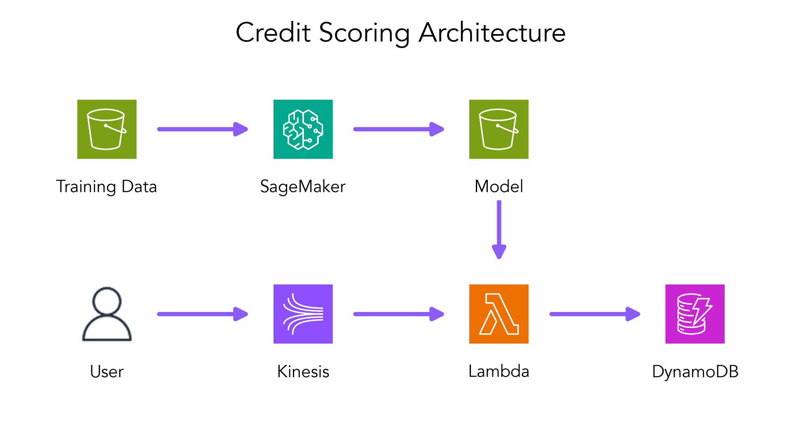
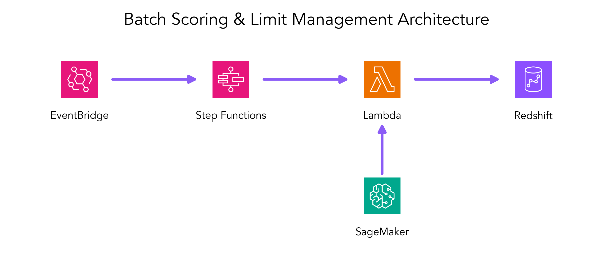

# 📚 Credit Risk Modeling on AWS ☁️

This repository contains code examples and implementations from the **Credit Risk Modeling on AWS** book project.

Author: [Denis Burakov](https://github.com/deburky)

## 🧩 Use Cases

This project demonstrates several credit risk modeling use cases using AWS services, including model training, deployment, and inference pipelines.

> [!IMPORTANT]  
> To run the code examples, you need to have Docker installed and have AWS credentials to use SageMaker local mode. You can get AWS credentials by creating an AWS account and then creating an IAM user with the necessary permissions.

### 🚀 Real-Time Credit Scoring



The `real_time_scoring/` folder contains a complete implementation of a real-time credit scoring system using:

- **SageMaker** for model training
- **Kinesis** for streaming loan applications
- **Lambda** for real-time scoring
- **DynamoDB** for storing approved applications
- **CloudFormation** for infrastructure as code

Run the workflow using the Makefile:

```bash
cd real_time_scoring/local && make run-workflow
```

> [!NOTE]
> See the [README.md](real_time_scoring/local/README.md) for detailed instructions.

### 🚀 Batch Scoring & Credit Limit Management

The `batch_scoring/` folder contains a complete implementation of a batch credit scoring and limit management system.

We use CatBoost with SHAP values for model training and PostgreSQL (as a local Redshift-compatible database) for storing customer batch scores.



The `batch_scoring/` folder contains a complete implementation of a batch credit scoring and limit increase system using:

- **SageMaker Pipelines** for ML workflow orchestration
- **SageMaker** for model training (CatBoost with SHAP values)
- **PostgreSQL** for storing customer batch scores
- **SageMaker Processing Steps** for querying, inference, evaluation, and database updates
- **LocalStack** for local S3 storage

Run the workflow using the Makefile:

```bash
cd batch_scoring/local && make run-workflow
```

> [!NOTE]
> See the [README.md](batch_scoring/local/README.md) for detailed instructions.

## 📄 License

[LICENSE](LICENSE)

## 🔗 References

* [Amazon SageMaker - Run Pipelines Using Local Mode](https://docs.aws.amazon.com/sagemaker/latest/dg/pipelines-local-mode.html)
* [An Unsung Hero of Amazon SageMaker: Local Mode](https://www.tecracer.com/blog/2024/06/an-unsung-hero-of-amazon-sagemaker-local-mode.html)
* [AWS in Plain English - Develop AWS ML Workloads Locally with LocalStack and SAM](https://aws.plainenglish.io/develop-aws-ml-workloads-locally-with-localstack-and-sam-24bdc0de81aa)
* [GitHub - aws-samples/amazon-sagemaker-local-mode](https://github.com/aws-samples/amazon-sagemaker-local-mode)


