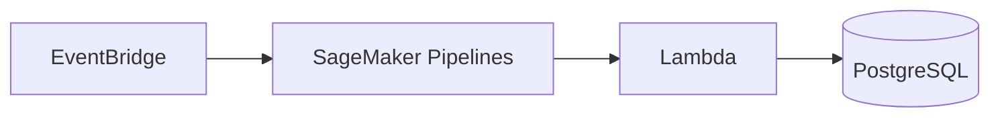

# Batch Scoring & Limit Management

Batch credit scoring workflow using SageMaker Pipelines, PostgreSQL, and LocalStack Lambda.

## Quick Start

```bash
# Start services
make start

# Setup database
make setup-db

# Run workflow
make run-workflow

# Check results (automatically done in run-workflow)

# Setup EventBridge trigger (optional)
make setup-eventbridge
```

## Architecture



**High-Level Flow:**

1. **EventBridge** - Scheduled trigger (daily at 2 AM UTC) → triggers pipeline
2. **SageMaker Pipelines** - Orchestrates training, query, and inference steps
3. **Lambda** - Applies business rules for limit decisions (INCREASE/DECREASE/KEEP)
4. **PostgreSQL** - Stores final decisions and updated limits

**Detailed Pipeline Steps:**

1. **TrainCatBoostModel** - Train CatBoost model, save to S3
2. **QueryBatchScores** - Query eligible customers from PostgreSQL
3. **SageMakerInference** - Score customers using trained model
4. **Lambda (limit_manager)** - Apply business rules for decisions
5. **Update Database** - Save decisions to PostgreSQL

**Note:** EventBridge triggers a Lambda function (`pipeline_trigger.py`) that starts the SageMaker Pipeline. This is a LocalStack limitation - on real AWS, EventBridge can directly trigger SageMaker Pipelines, which is why the architecture diagram shows a direct flow from EventBridge to SageMaker Pipelines.

## Prerequisites

- Docker and Docker Compose
- Python 3.11+
- `uv` package manager

## Installation

```bash
uv pip install -r requirements.txt
```

## Workflow

The pipeline orchestrates:

- **Training**: CatBoost model with SHAP values
- **Query**: Eligible customers (score ≥ 600, limit < $10,000)
- **Inference**: ML scoring using trained model
- **Decisions**: Lambda applies business rules (INCREASE/DECREASE/KEEP)
- **Update**: PostgreSQL with final decisions

### Training Options

**Direct Training** (fast, local):

```bash
make train-catboost
```

**SageMaker Training** (saves to S3):

```bash
make train-sagemaker
```

## Database Schema

```sql
CREATE TABLE batch_scores (
    customer_id VARCHAR(50) PRIMARY KEY,
    current_score INTEGER NOT NULL,
    current_limit DECIMAL(10, 2) NOT NULL,
    application_date DATE NOT NULL,
    limit_increase_decision VARCHAR(20),
    new_limit DECIMAL(10, 2),
    decision_reason TEXT,
    updated_at TIMESTAMP
);
```

## Files

**Training:**

- `training/train.py` - SageMaker container entry point
- `training/train_catboost.py` - Direct training script
- `training/sagemaker_train.py` - SageMaker training orchestrator
- `training/sagemaker_pipeline.py` - Pipeline definition

**Scripts:**

- `scripts/database.py` - Database operations (setup, query, update, check)
- `scripts/inference_processing.py` - ML inference processing

**Lambda:**

- `lambda_functions/pipeline_trigger.py` - Starts pipeline from EventBridge
- `lambda_functions/limit_manager.py` - Business logic for decisions

**Setup:**

- `scripts/setup_eventbridge.py` - Configure EventBridge rule and Lambda trigger

## EventBridge Integration

EventBridge can trigger the pipeline on a schedule:

```bash
# Setup EventBridge rule (daily at 2 AM UTC)
make setup-eventbridge
```

The rule triggers a Lambda function that starts the complete pipeline workflow. To modify the schedule, edit `scripts/setup_eventbridge.py` and change `SCHEDULE_EXPRESSION`.

## Testing

```bash
# Run complete workflow (setup, build, EventBridge, pipeline, results)
make run-workflow

# Individual tests
make test-lambda
make test-db-update
```

## Troubleshooting

**PostgreSQL not accessible:**

```bash
docker-compose logs postgres
```

**LocalStack S3 issues:**

```bash
docker-compose logs localstack
```

**Model not found:**

```bash
make train-catboost
```

## Cleanup

```bash
make clean
```
